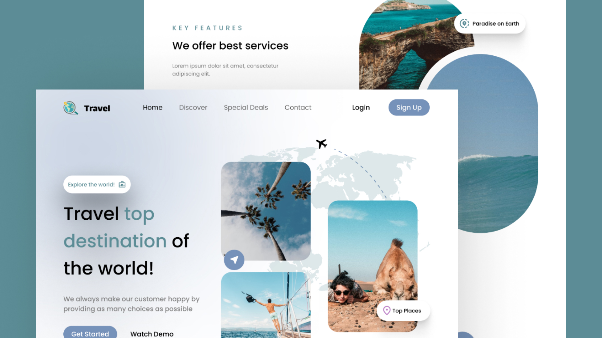

# Travel landing page

The design of this project was created by a highly skilled UI designer named **Didem Güler**. It was a great privilege to collaborate with Didem in implementing this exceptional UI. Didem is an accomplished UI/UX designer employed at The Hot platform, where she expertly crafts stunning user interfaces and creates memorable and enjoyable experiences for end users.

**Below is my workflow about the implementation of this project.**

## Workflow

#### Mobile First Implementation
I employed a standardized frontend approach called the "Mobile first approach" to create this landing page. 

The utilization of TailwindCSS, a CSS framework, greatly facilitated the development of the mobile viewport due to its wide range of utility classes and component libraries.

### Component Thinking
Organizing my layouts into small yet functional and reusable pieceses gave me a flexible hand in developing this landing page without hassel.

[ReactJS](https://legacy.reactjs.org/docs/getting-started.html) was the tool I used to achieve this desired outcome.

#### Getting Started with Create React App

This project was bootstrapped with [Create React App](https://github.com/facebook/create-react-app).

#### Available Scripts

In the project directory, you can run:

#### `npm start`

Runs the app in the development mode.\
Open [http://localhost:3000](http://localhost:3000) to view it in your browser.

The page will reload when you make changes.\
You may also see any lint errors in the console.

#### Learn More

You can learn more in the [Create React App documentation](https://facebook.github.io/create-react-app/docs/getting-started).

To learn React, check out the [React documentation](https://reactjs.org/).

#### `npm run build` fails to minify

This section has moved here: [https://facebook.github.io/create-react-app/docs/troubleshooting#npm-run-build-fails-to-minify](https://facebook.github.io/create-react-app/docs/troubleshooting#npm-run-build-fails-to-minify)
